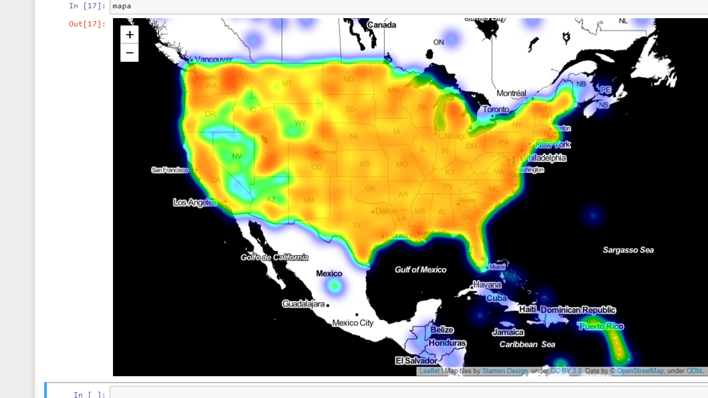
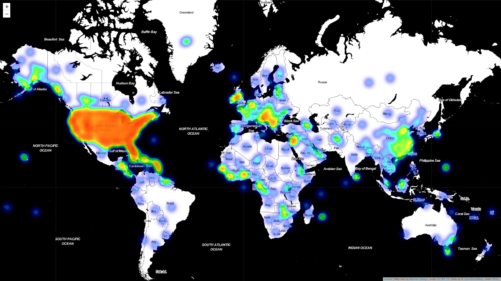
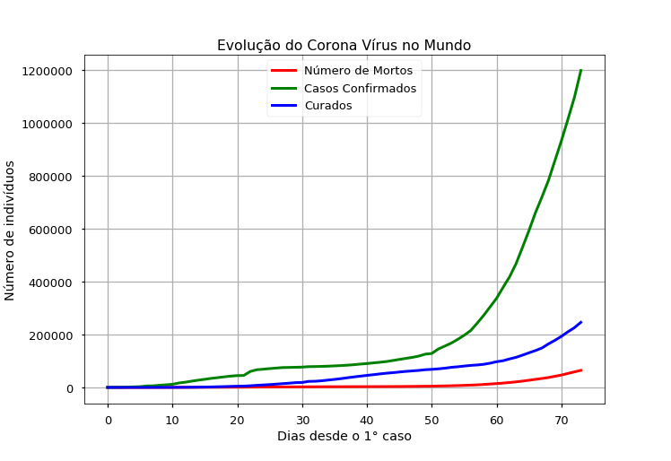

# US Heat Map

# World Heat Map

# Coronavirus plot

# Coronavirus
## Datascience applied to the spread of coronavirus
## Used libraries:

- [x] matplotlib
- [x] pandas
- [x] numpy
- [x] geopandas
- [x] folium
- [x] math
- [x] imageio
- [x] datetime

